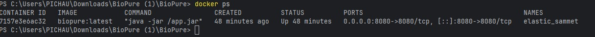
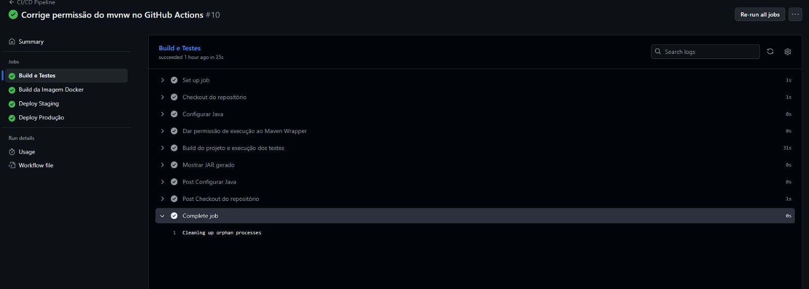
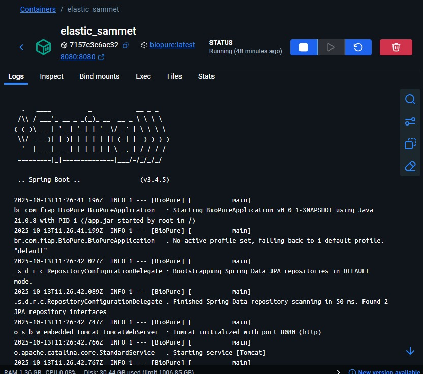

# Projeto - BioPure

O BioPure é uma aplicação robusta desenvolvida em Java com Spring Boot, projetada para [**Adicione aqui uma breve descrição do objetivo do projeto, por exemplo: "gerenciar e monitorar dados de qualidade da água."**]. A arquitetura do projeto foi pensada para ser escalável, segura e de fácil manutenção, utilizando práticas modernas de desenvolvimento e DevOps.

## Como executar localmente com Docker

Para garantir um ambiente de desenvolvimento padronizado e simplificado, o projeto utiliza Docker e Docker Compose. Siga os passos abaixo para executar a aplicação localmente.

### Pré-requisitos

- [Git](https://git-scm.com/)
- [Docker](https://www.docker.com/get-started)
- [Docker Compose](https://docs.docker.com/compose/install/)

### Passos para Execução

1.  **Clone o repositório:**
    ```bash
    git clone [https://github.com/SEU-USUARIO/BioPure.git](https://github.com/SEU-USUARIO/BioPure.git)
    cd BioPure
    ```

2.  **Construa a aplicação e suba os contêineres:**
    O comando a seguir irá primeiro compilar a aplicação Java usando o Maven e, em seguida, construir a imagem Docker e iniciar o contêiner.
    ```bash
    docker-compose up --build
    ```
    *Observação: O `docker-compose.yml` está configurado para executar o build do Maven antes de criar a imagem final, garantindo que a versão mais recente do código esteja sempre em execução.*

3.  **Acesse a aplicação:**
    Após a inicialização dos contêineres, a API estará disponível para acesso no seguinte endereço:
    - **API BioPure:** `http://localhost:8080`

4.  **Para parar a execução:**
    Para parar e remover o contêiner, pressione `Ctrl + C` no terminal onde o compose está rodando e execute:
    ```bash
    docker-compose down
    ```

## Pipeline CI/CD

Para implementar a integração e entrega contínua (CI/CD), foi utilizado o **GitHub Actions**, uma ferramenta nativa do GitHub que automatiza o processo de build, testes e deploy do projeto sempre que há alterações no código.

### 🛠️ Ferramentas Utilizadas
- **GitHub Actions** → Plataforma de automação para executar pipelines diretamente no repositório.
- **Maven** → Gerenciador de dependências e build da aplicação Java Spring Boot.
- **Java 21** → Linguagem e versão utilizadas no projeto.
- **Ubuntu (GitHub Runner)** → Sistema operacional usado no ambiente do pipeline.

### ⚙️ Etapas do Pipeline
O pipeline é acionado a cada `push` na branch `main` e consiste nas seguintes etapas:

1.  **Checkout do Código:** O workflow baixa a versão mais recente do código do repositório para o ambiente de execução do GitHub Actions.

2.  **Configuração do Java e Maven:** O ambiente é preparado com a versão 21 do JDK da Oracle, que é necessária para compilar a aplicação.

3.  **Permissão de Execução do Maven Wrapper:** O script `mvnw` recebe permissão de execução para poder ser usado na etapa seguinte.

4.  **Build e Testes:** O comando `./mvnw clean install` é executado. Ele limpa o diretório de build, compila todo o código-fonte, executa os testes unitários automatizados e empacota a aplicação em um arquivo `.jar`.

### ✅ Funcionamento
Sempre que um push é feito na branch `main`, o pipeline é automaticamente iniciado. Ele garante que o código passe pelos testes e seja compilado com sucesso, assegurando a integridade da base de código e preparando um artefato (`.jar`) pronto para o deploy.

## 🐳 Containerização

A aplicação é containerizada com Docker para garantir portabilidade e consistência entre os ambientes de desenvolvimento e produção.

### Conteúdo do Dockerfile

O `Dockerfile` utiliza uma abordagem de **multi-stage build** para criar uma imagem final otimizada, contendo apenas o necessário para a execução, resultando em uma imagem mais leve e segura.

```dockerfile
# Estágio 1: Build com Maven
# Usa uma imagem do Maven com JDK 21 para compilar a aplicação
FROM maven:3.9.5-sapmachine-21 AS build
WORKDIR /app
COPY . .
RUN mvn clean install -DskipTests

# Estágio 2: Imagem de Produção
# Usa uma imagem base do Java 21, mais leve que a de build
FROM openjdk:21-jdk-slim
WORKDIR /app

# Copia o artefato .jar gerado no estágio anterior
COPY --from=build /app/target/*.jar app.jar

# Expõe a porta que a aplicação irá rodar
EXPOSE 8080

# Comando para iniciar a aplicação Java
ENTRYPOINT ["java", "-jar", "app.jar"]
```

### Estratégias Adotadas

-   **Multi-stage Builds:** A primeira etapa (`build`) usa uma imagem completa do Maven para compilar o projeto. A segunda etapa copia apenas o `.jar` resultante para uma imagem Java (`openjdk:21-jdk-slim`) muito menor, descartando as dependências de build e o código-fonte.
-   **Imagens Otimizadas:** A imagem `openjdk:21-jdk-slim` é utilizada na fase final por ser significativamente mais leve que a imagem padrão, o que acelera o download e o deploy.

## 📸 Prints do Funcionamento

Abaixo estão as evidências do projeto em execução.

### Pipeline CI/CD no GitHub Actions


### Execução Local via Docker Compose


### Acesso à API


## 🛠️ Tecnologias Utilizadas

-   **Backend:**
    -   [Java 21](https://www.oracle.com/java/)
    -   [Spring Boot 3](https://spring.io/projects/spring-boot)
    -   [Spring Data JPA](https://spring.io/projects/spring-data-jpa)
    -   [Spring Security](https://spring.io/projects/spring-security)
-   **Banco de Dados:**
    -   [H2 Database](https://www.h2database.com/) (para desenvolvimento e testes)
-   **Build e Gerenciamento de Dependências:**
    -   [Apache Maven](https://maven.apache.org/)
-   **DevOps & Infraestrutura:**
    -   [Docker](https://www.docker.com/)
    -   [Docker Compose](https://docs.docker.com/compose/)
    -   [GitHub Actions](https://github.com/features/actions) (para CI/CD)
---